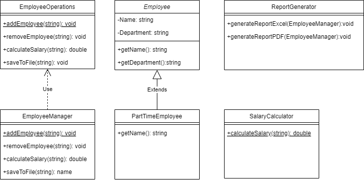
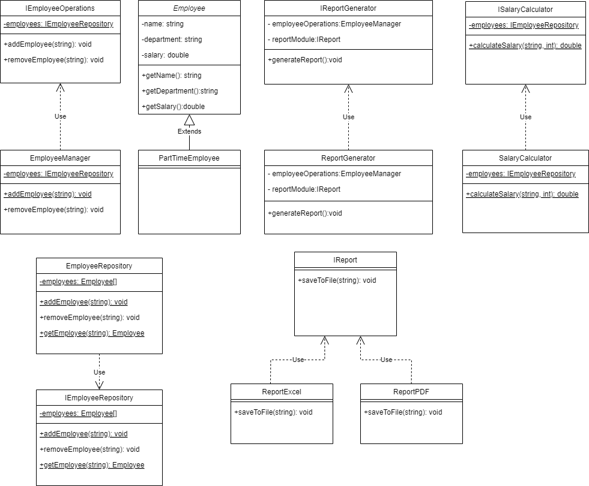

# Members
- Sebastian Cardozo Padilla
- Nestor Javier Mahecha Parra
- Karen Dayana Martinez Perez

# Analysis

- EmployeeManager viola SRP: porque además de manejar los empleados también guarda el archivo y calculaba salarios.
- ReportGenerator viola OCP: dado que para agregar una nueva extensión habria que ir a la clase y crear un nuevo metodo.
- PartTimeEmployee viola LSP: porque la clase lanza una excepción al usar getName, afectando la corrección del programa.
- SalaryCalculator viola DIP: porque inyecta una dependencia de EmployeeManager (bajo nivel) en lugar de usar la abstracción.

# Solution

